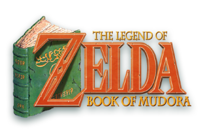

# Zelda Book of Mudora

This package contains the data files of the quest **Zelda: Book of Mudora**.
This quest is a free, open-source game that works with Solarus,
an open-source Zelda-like 2D game engine.
To play this game, you need Solarus. The compiled engine is included for Windows.

The game is currently in Version 1.4 (30-Mar-19, Solarus v1.6)

## How to run

* Windows: execute `solarus.exe`
* Linux: download executable or compile source available at <https://www.solarus-games.org> (see compile instruction below)
* Mac: download executable or compile source available at <https://www.solarus-games.org>

## Controls

* <kbd>X</kbd> to use/assign left grey circle item and <kbd>V</kbd> to use/assign right grey circle item.
* <kbd>C</kbd> for green circle (sword or skip in dialogs).
* <kbd>Space</kbd> for blue circle (action or back in dialogs).
* <kbd>D</kbd> for Pause menu (or to exit pause).
* <kbd>←</kbd> or <kbd>→</kbd> to scroll between items and submenus.

Buttons can be remapped (to other keys or joypad buttons) from within the Options submenu.
Control key allows you to pan the camera slightly.

## More information

See our website http://sites.google.com/site/zeldabom for more information.

Enjoy!
